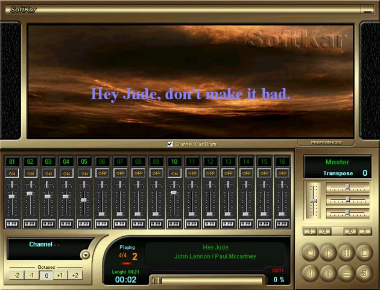



## Karaoke II

### Description

Karaoke Player

This is the second version of my Karaoke Player, that has

the functionalities of the previous with these new additions:

It controls each one of the 16 independent channels.

It alters the instruments in each channel

Possibility to alter the tone of the music (Transpose)

Works with Play List

It use the DiretcX 7
 
### More Info
 

             |
---                |---
**Submitted On**   |2001-04-01 17:54:02
**By**             |[Arruda](https://github.com/Planet-Source-Code/PSCIndex/blob/master/ByAuthor/arruda.md)
**Level**          |Advanced
**User Rating**    |4.3 (47 globes from 11 users)
**Compatibility**  |VB 4\.0 \(32\-bit\), VB 5\.0, VB 6\.0
**Category**       |[Sound/MP3](https://github.com/Planet-Source-Code/PSCIndex/blob/master/ByCategory/sound-mp3__1-45.md)
**World**          |[Visual Basic](https://github.com/Planet-Source-Code/PSCIndex/blob/master/ByWorld/visual-basic.md)
**Archive File**   |[Karaoke II17795412001\.zip](https://github.com/Planet-Source-Code/arruda-karaoke-ii__1-22073/archive/master.zip)

